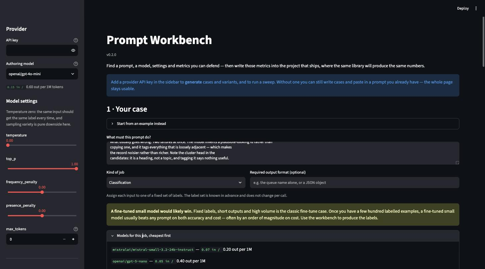

# Prompt Workbench

A [Streamlit](https://streamlit.io/) workspace for arriving at a prompt
configuration you can defend — a prompt, a model, its settings, and the
[deepeval](https://github.com/confident-ai/deepeval) metrics and thresholds that
say whether it still works — and then writing those metrics into the project
that ships.

Built by [Moha Kashani](mailto:s.moha.m.kashani@gmail.com) as a demonstration of
production-minded LLM application engineering.

> **Status:** early. The flow from a described case to a ranked sweep works and
> is covered by an offline test suite. Nothing persists beyond the browser
> session.



## The idea

A prompt on its own is not a deliverable. What you actually need is a
*configuration you can defend*: a prompt, a model, its settings, and the metrics
and thresholds that say whether it still works — so the same metrics can go into
an automated test in the project that ships.

Two things make that possible here. The workbench knows what **kind of job** the
prompt does, so it can suggest the approaches, models and measurements that suit
it rather than a fixed list applied to everything. And it knows what things
**cost**, from the provider's live prices, so "the cheapest thing that works" is
arithmetic instead of an opinion.

## The workflow

1. **Describe your case.** Free text. A task type is proposed from it and stays
   overridable — it is the choice everything downstream follows from.
2. **Get test cases.** Generated from the description, and yours to edit. A case
   you would not have written is a measurement you should not trust.
3. **Write the variants.** One prompt per approach, chosen for that kind of job:
   a classifier gets strict enumeration, few-shot over its real labels and a
   JSON schema; a drafting job gets outline-then-write and named anti-patterns.
4. **Choose the metrics.** deepeval metrics, suggested for the task type at
   starting thresholds, with the constructor shown as you tune it.
5. **Sweep.** Pick variants and models, see the call count and estimated cost
   *before* anything is spent, then run. Results rank by score with cost
   breaking ties, and the cheapest configuration clearing every threshold is
   named.
6. **Carry it across.** Paste the metric code into the project that ships.
   Nothing is exported to disk — you write it deliberately, where it belongs.

Ten worked situations, drawn from real production prompts, are available as
starting points under "Start from an example". They show what a well-shaped case
looks like; they are not what the workbench is for.

## The ten kinds of job

| Task type | Settings it wants | Fine-tune verdict |
| --- | --- | --- |
| Classification | temperature 0, structured | **likely** at volume |
| Extraction | temperature 0, JSON schema | **likely** at volume |
| Routing | temperature 0 | **likely** at volume |
| Summarization | temperature ~0.3 | sometimes |
| Generation / drafting | temperature ~0.7 | unlikely |
| Grounded question answering | temperature 0 | unlikely |
| Judging / scoring | temperature 0, strong model only | unlikely |
| Agentic tool use | temperature 0, strong model | unlikely |
| Transformation / rewriting | temperature ~0.2 | sometimes |
| Safety / guardrail | temperature 0 | sometimes |

A prompt workbench that never says "this job should not be a prompt" is selling
something, so the fine-tune verdict is stated up front for every type.

## Metrics

The metric layer is [deepeval](https://github.com/confident-ai/deepeval), behind
an optional extra:

```console
uv sync --extra deepeval
```

It is optional because it costs about thirty transitive packages, including
telemetry — which is pinned off before deepeval is imported. Everything except
the metric work runs without it.

Using deepeval rather than something local is the point: what you tune here is
the same class with the same threshold that goes into your own test suite, so
nothing has to be translated on the way out — and a translated threshold is a
new threshold.

Metrics run on either the local `codex` CLI, wired in as a custom deepeval model
so no API key is needed, or a provider model. The CLI is for iterating; a
provider judge gives the numbers your real suite will produce. GEval prefers
token logprobs and a subprocess cannot supply them, so confirm a threshold on a
provider judge before committing to it.

## Design principles

- **The task type decides.** Approaches, models, settings and metrics all follow
  from what kind of job the prompt does, instead of one fixed list for everything.
- **Cost is arithmetic.** Live per-token prices and measured token counts, so
  "cheapest that works" is a number rather than a hunch.
- **Nothing spends without asking.** A sweep shows its call count and estimated
  cost and waits for confirmation.
- **Nothing hidden.** Test cases, prompt variants, metric thresholds and the
  metric constructor itself are on screen and editable, not buried in code.
- **Evaluation is a decision, not a side effect.** No edit, generation or
  setting change triggers a judge call; only a confirmed sweep spends.
- **A number belongs to what produced it.** Edit a case, a variant, a metric or
  a setting and the results are cleared rather than left to be misread.
- **Nothing fails quietly.** A judge that times out is recorded as a visible
  failure and left out of the score, never softened into a neutral number.

## How it is built

A thin Streamlit layer over three inward-pointing layers. `core/` orchestrates
the work, `services/` is the only place that opens a socket or spawns a process,
and `models/` is dependency-free typed data with the port protocols. Nothing in
`core/` or `models/` imports Streamlit or a provider SDK, so every layer is
testable without a browser — and the suite injects fake ports, so no test makes
a live call, including the CLI judge, whose subprocess runner is injected too.

Two structural rules are enforced by tests rather than by convention: the
generation modules cannot import the evaluator, so no edit can start a scoring
call; and rendering a page reaches neither the provider nor the judge CLI.

## Quick start

Requires [uv](https://docs.astral.sh/uv/) and an API key for an
OpenAI-compatible model provider (defaults to
[OpenRouter](https://openrouter.ai/)).

```console
uv sync                          # install dependencies into .venv
cp .env.example .env             # then set PROVIDER_API_KEY in .env
uv run streamlit run src/prompt_workbench/app.py
```

You can also paste the API key into the app's sidebar instead of using `.env`;
it stays in that browser session.

### Docker

```console
docker build -t prompt-workbench .
docker run --rm -p 8501:8501 -e PROVIDER_API_KEY=your_key prompt-workbench
```

Then open <http://localhost:8501>.

## Development

```console
uv run pytest    # test suite (no live model calls)
uv run mypy      # strict type check of src/
```

The optional local judge needs the [`codex`](https://developers.openai.com/codex/cli/)
CLI on your `PATH` and signed in. The sidebar says whether it was found; without
it, pick the provider judge in the Evaluate area.

## License

Copyright © 2026 Moha Kashani. **All rights reserved.**

This code is published for portfolio and demonstration purposes only. Viewing
it and running it locally to evaluate the author's work is permitted; any
other use, copying, modification, or distribution requires prior written
permission — see [`LICENSE`](LICENSE). For services or collaboration,
[get in touch](mailto:s.moha.m.kashani@gmail.com).
